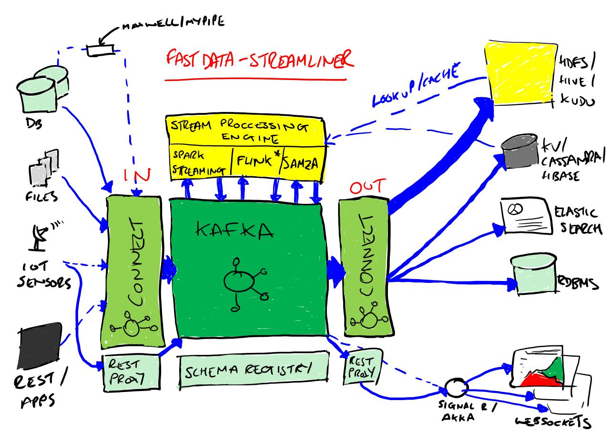

.. StreamReactor documentation master file, created by Andrew Stevenson

.. figure:: ../images/DM-logo.jpg
   :alt: 

Stream Reactor
=============

The Stream Reactor is a set of components to build a reference architecture for streaming data platforms. At it's core is Kafka, with Kafka Connect providing a unified way to stream data in and out of the system.

The actual processing if left to streaming engines and libraries such as Spark Streaming,  Apache Flink, Storm and Kafka Streams.

DataMountaineer provides a range of supporting components so the main technologies, mainly Kafka, Kafka Connect and the Confluent Platform.

Kafka Connectors

.. toctree::
   :maxdepth: 3

   connectors
   tools
   socket-streamer
